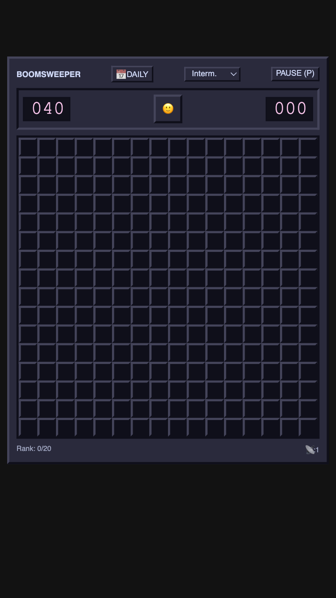
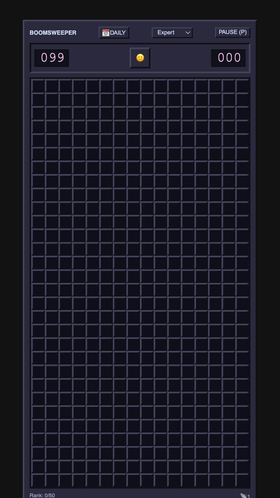

# Pi-cade 🕹️

A lightweight, mobile-first HTML5/JS arcade hub designed to be hosted on a Raspberry Pi and played on mobile touch screens. 

## Games Included

### Voidroids 🚀
A classic space shooter with a modern touch. Navigate your ship, blast asteroids, and collect power-ups!
- **Controls:** Fully functional on-screen D-Pad and action buttons optimized for thumbs on mobile devices.
- **Features:** Shields, Magnet Traps, Shotguns, and Boss fights.

### Boomsweeper 💣
A sleek, responsive take on the classic mine-clearing game.
- **Mobile Optimized:** Dynamically scales to fit any device screen perfectly.
- **Smart Orientations:** Expert mode (30x16) is oriented vertically for natural portrait-mode gameplay.
- **Difficulties:** Beginner (9x9), Intermediate (16x16), and Expert (30x16).

## Screenshots

| Boomsweeper (Intermediate) | Boomsweeper (Expert) |
| :---: | :---: |
|  |  |

## Hosting & Deployment
The files can be hosted directly on any lightweight web server (like NGINX or Apache) directly from your Raspberry Pi.
